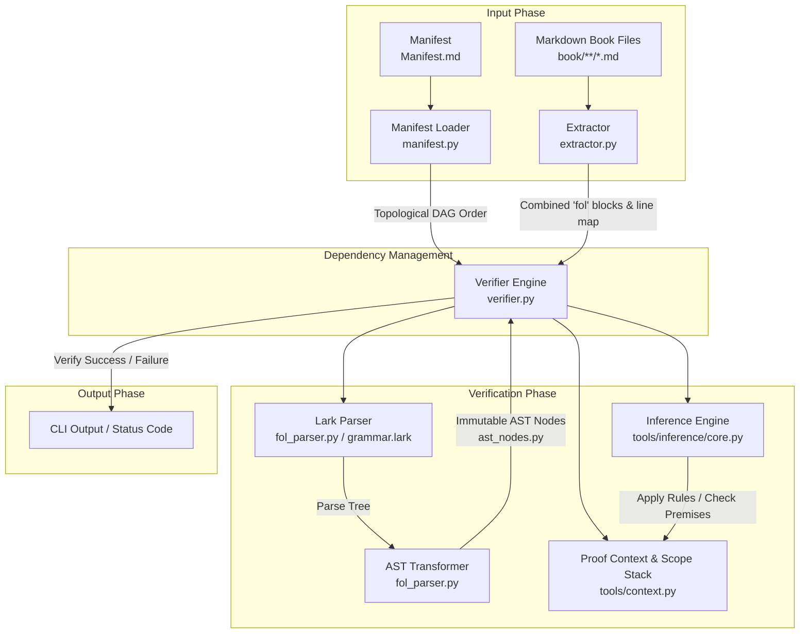

# Aleph System Design Document

This document provides a comprehensive overview of the design, architecture, and internals of the
**Aleph** literate mathematical verification system.

______________________________________________________________________

## 1. System Pipeline Overview

The following diagram illustrates the complete verification pipeline from the source Markdown files
in the book to the final validation of mathematical theorems.



______________________________________________________________________

## 2. Architecture & Components

The codebase is split into two primary layers: `tools/parser` (for extracting and lexing/parsing FOL
statements) and `tools/verifier` (for managing scopes and evaluating proofs).

| Component | Source File(s) | Responsibility | | :--- | :--- | :--- | | **CLI & Commands** |
\[cli.py\](file:///c:/Users/erh50/Aleph/tools/cli.py) | Centralized developer CLI for commands
(`verify`, `format`). | | **Fenced Extractor** |
\[extractor.py\](file:///c:/Users/erh50/Aleph/tools/parser/extractor.py),
\[common.py\](file:///c:/Users/erh50/Aleph/tools/common.py) | Extracts the raw text within
```` ```fol ```` code blocks and tracks lines back to the original `.md` files. | | **Lark FOL
Parser** | \[fol_parser.py\](file:///c:/Users/erh50/Aleph/tools/parser/fol_parser.py),
\[grammar.lark\](file:///c:/Users/erh50/Aleph/tools/parser/grammar.lark) | Tokenizes and parses the
FOL logic using Earley parsing grammar rules. | | **AST Nodes** |
\[ast_nodes.py\](file:///c:/Users/erh50/Aleph/tools/parser/ast_nodes.py) | Frozen, immutable
dataclass AST representation of formulas, variables, and declarations. | | **AST Transformers &
Utils** | \[ast_transformer.py\](file:///c:/Users/erh50/Aleph/tools/parser/ast_transformer.py),
\[ast_utils.py\](file:///c:/Users/erh50/Aleph/tools/parser/ast_utils.py) | Visitor patterns to apply
variable substitutions, term replacements, and query free variables. | | **Manifest & Topological
Graph** | \[manifest.py\](file:///c:/Users/erh50/Aleph/tools/verifier/manifest.py),
\[section.py\](file:///c:/Users/erh50/Aleph/tools/verifier/section.py) | Loads the topological build
graph, resolves imports/exports, and ensures no cycles exist. | | **Proof Context & Scoping** |
\[context.py\](file:///c:/Users/erh50/Aleph/tools/context.py) | Stores active axioms, theorems,
constants, definitions, and active logical assumption scopes. | | **Verifier Main Loop** |
\[verifier.py\](file:///c:/Users/erh50/Aleph/tools/verifier/verifier.py) | Orchestrates the
top-level declaration verification and proof step verification. | | **Inference Engine** |
\[inference/\](file:///c:/Users/erh50/Aleph/tools/inference/) | Modules verifying individual
mathematical rules of inference ( propositional, quantifier, equality, definitions, references). |

______________________________________________________________________

## 3. Core Verification Logic & Lifecycles

### A. Declaration Verification Flow

When verifying a section, the system processes declarations inside the combined `fol` block in
order:

1. **Axioms**: Registered immediately in the current `ProofContext` as trusted formulas.
2. **Schemas**: Registered immediately as templates parameterized by formula placeholders.
3. **Definitions**: Verified to check that the LHS and RHS contain the exact same set of free
   variables (ignoring known constants, operations, and definitions), then registered as universally
   quantified biconditionals or equalities.
4. **Theorems**: Fully evaluates each step of the proof (see below), asserting the final line
   matches the theorem's claim.
5. **Constants & Operations**: Verified by proving both *existence* and *uniqueness* theorems. The
   verifier checks that both existence and uniqueness statements match the signatures derived from
   the operation/constant formula, then registers the symbol.

### B. Topological DAG ordering & Lazy Loading

Aleph avoids verification bottlenecks and compilation cascading by using a topological graph
specified in \[Manifest.md\](file:///c:/Users/erh50/Aleph/book/Manifest.md):

- The verifier constructs a graph where sections are nodes and imports are directed edges.
- It uses `graphlib.TopologicalSorter` to resolve a linear verification order.
- Symbols are **lazy-loaded** on-demand when imported (see `ensure_section_loaded` in
  `manifest.py`). If a section is not yet in the global verification cache, it is parsed and its
  exported symbols are cached.
- Each verification run verifies that the manifest contains no cycles and no orphaned files.

### C. Proof Context & Scope Stack

Proof verification evaluates a list of proof steps inside a theorem using a scope stack (`Scope`
class):

- The proof begins at the **Root Scope** (depth 1).
- **Scope Openers**:
  - `Let x1, ..., xN be arbitrary` introduces free variables and pushes a new child scope.
  - `Assume P` introduces an assumption and pushes a new child scope.
- **Scope Closers**:
  - Rules like `ImplIntro` (implication introduction), `UG` (universal generalization), and
    `ExistsElim` (existential elimination) pop the current scope.
  - The resulting line is checked at the *parent* scope's column/indentation.
- **Visibility Rules**:
  - A proof step can only reference premise lines that exist in its current scope or ancestor
    scopes. Referencing a line inside a closed sibling scope raises a `VerificationError`.

```text
Root Scope (Depth 1)
 └── Let Scope (Depth 2, introduces x)
      └── Assume Scope (Depth 3, assumes x ∈ A)
```

______________________________________________________________________

## 4. Inference Rules

Aleph verifies steps using hardcoded mathematical deduction rules. Below is a mapping of rules to
their implementations:

| Module | Inference Rules Implemented | | :--- | :--- | |
**\[propositional.py\](file:///c:/Users/erh50/Aleph/tools/inference/propositional.py)** |
`Hypothesis`, `MP` (Modus Ponens), `MT` (Modus Tollens), `DS` (Disjunctive Syllogism), `AndIntro`,
`AndElim`, `OrIntro`, `OrElim`, `OrCases`, `OrIdem`, `DNE` (Double Negation Elimination), `DNI`
(Double Negation Introduction), `RAA` (Reductio Ad Absurdum), `Vacuous`, `IffIntro`, `IffElim`,
`IffMP`, `IffMT`, `IffTrans`, `Contradiction` | |
**\[quantifier.py\](file:///c:/Users/erh50/Aleph/tools/inference/quantifier.py)** | `UI` (Universal
Instantiation), `UG` (Universal Generalization), `ExistsIntro` (Existential Introduction),
`ExistsElim` (Existential Elimination) | |
**\[equality.py\](file:///c:/Users/erh50/Aleph/tools/inference/equality.py)** | `EqIntro` (Equality
Introduction), `EqReplace` (Equality Replacement), `EqReplaceAll` (Replace All Occurrences) | |
**\[definitions.py\](file:///c:/Users/erh50/Aleph/tools/inference/definitions.py)** | `Def`
(Definition Expansion/Contraction) | |
**\[references.py\](file:///c:/Users/erh50/Aleph/tools/inference/references.py)** | `Axiom` (Axiom
Cite), `Theorem` (Theorem Cite), `Constant` (Constant Cite), `Operation` (Operation Cite), `Schema`
(Schema Instantiation) |

______________________________________________________________________

## 5. Maintenance Protocol

> [!IMPORTANT] **This design document is the primary developer contract for Aleph's codebase
> architecture. It must be kept in sync with the codebase.**
>
> Both human contributors and AI agents are required to adhere to the following rules:
>
> 1. **Parser Changes**: If `grammar.lark` or `ast_nodes.py` are modified (e.g., adding term types
>    or operators), update the **Architecture & Components** section.
> 2. **Inference Changes**: If a new rule of inference is added to the verifier, it must be added to
>    the registry and documented in the **Inference Rules** mapping table above.
> 3. **Verifier Loop Changes**: If the lifecycle of constants, definitions, or proof scopes is
>    modified, update the **Core Verification Logic & Lifecycles** section.
