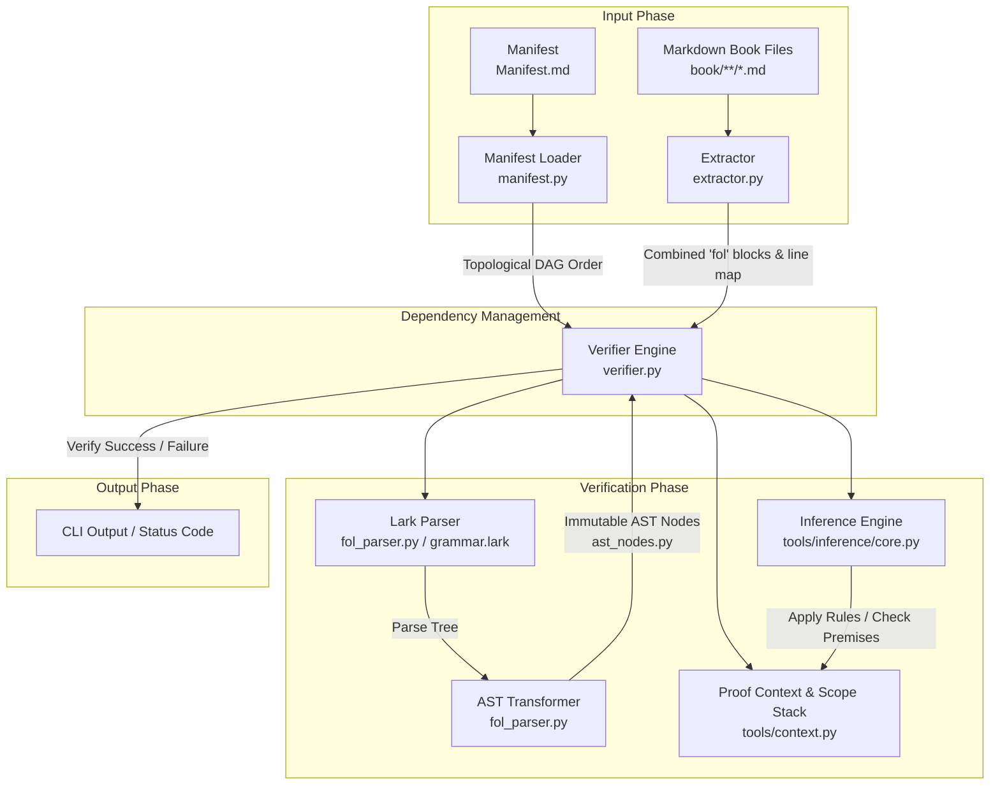

# Aleph System Design Document

This document provides a comprehensive overview of the design, architecture, and internals of the
**Aleph** verification system.

## 1. System Pipeline Overview

The following diagram illustrates the complete verification pipeline from the source Markdown files
in the book to the final validation of mathematical theorems.



## 2. Architecture & Components

The codebase is split into two primary layers: `tools/parser` (extraction and parsing) and
`tools/verifier` (scope management and proof evaluation).

| Component | Source File(s) | Responsibility | | :--- | :--- | :--- | | **CLI & Commands** |
[cli.py](tools/cli.py) | Centralized CLI for `verify` and `format`. | | **Fenced Extractor** |
[extractor.py](tools/parser/extractor.py) | Extracts `fol` code blocks and tracks source line
mapping. | | **Lark FOL Parser** | [fol_parser.py](tools/parser/fol_parser.py) | Tokenizes and
parses FOL logic using [grammar.lark](tools/parser/grammar.lark). | | **AST Nodes** |
[ast_nodes.py](tools/parser/ast_nodes.py) | Immutable dataclass representation of formulas and
declarations. | | **AST Utils** | [ast_utils.py](tools/parser/ast_utils.py) | Tools for
substitution, term replacement, and free variable analysis. | | **Manifest & DAG** |
[manifest.py](tools/verifier/manifest.py) | Loads the topological build graph and resolves
imports/exports. | | **Proof Context** | [context.py](tools/context.py) | Manages active symbols and
logical assumption scopes. | | **Verifier Engine** | [verifier.py](tools/verifier/verifier.py) |
Orchestrates declaration and proof step verification. | | **Inference Engine** |
[inference/](tools/inference/) | Modules implementing mathematical rules of inference. |

## 3. Verification Mechanics

The verifier uses deterministic structural AST matching rather than deep logical expansion.

- **Shallow Signature Matching:** Previously proven theorems are verified by matching the input
  lines against the theorem's required signature. The internal proof tree is not re-evaluated.
- **One-Layer Macros:** Definitions are unpacked exactly one layer deep during standard expansion.
- **Second-Order Substitution:** Axiom schemas are instantiated by substituting concrete formulas
  into parameterized templates.

## 4. Core Verification Logic

### A. Declaration Verification Flow

1. **Axioms**: Registered immediately as trusted formulas.
2. **Schemas**: Registered as templates with formula placeholders.
3. **Definitions**: Verified to ensure LHS and RHS free variables match, then registered as
   biconditionals or equalities.
4. **Theorems**: Every proof step is evaluated; the final line must match the claim.
5. **Symbols**: Require prior existence and uniqueness theorems. The verifier validates these
   signatures before registering the new symbol.

### B. Dependency Management & Manifest

The system enforces a hierarchical dependency graph via [Manifest.md](book/Manifest.md).

- **Topological Sorting:** The verifier uses `graphlib.TopologicalSorter` to determine a linear
  verification order.
- **Lazy Loading:** Symbols are loaded on-demand when imported. If a section is not in the global
  cache, it is parsed and its exports are indexed.
- **Integrity Invariants:**
  - **Completeness:** All `.md` files in `book/` must be registered in the manifest.
  - **Export Validation:** Declared exports must match the actual symbols in the file.
  - **Import Resolution:** All qualified imports must resolve to valid exported symbols.
  - **Acyclicity:** The dependency graph must remain a Directed Acyclic Graph (DAG).
- **Import/Export Rules:**
  - `exports`: Bare identifiers produced by a section.
  - `imports`: Fully qualified identifiers (e.g., `SetTheory.Extensionality.Extensionality`).
  - Self-references within a file are inherently available and do not require imports.

### C. Proof Context & Scoping

Proofs use a scope stack to manage variable and assumption visibility.

- **Visibility:** A step can only reference lines in its current scope or an ancestor scope.
- **Let/Assume:** Open one new scope level.
- **UG/ImplIntro/ExistsElim:** Close one scope level and return a conclusion to the parent scope.

```text
Root Scope (Depth 1)
 └── Let Scope (Depth 2, introduces x)
      └── Assume Scope (Depth 3, assumes x ∈ A)
```

## 5. Inference Rules Mapping

| Module | Rules | | :--- | :--- | | **[propositional.py](tools/inference/propositional.py)** |
`Hypothesis`, `MP`, `MT`, `DS`, `AndIntro`, `AndElim`, `OrIntro`, `OrElim`, `OrCases`, `OrIdem`,
`DNE`, `DNI`, `RAA`, `Vacuous`, `IffIntro`, `IffElim`, `IffMP`, `IffMT`, `IffTrans`, `Contradiction`
| | **[quantifier.py](tools/inference/quantifier.py)** | `UI`, `UG`, `ExistsIntro`, `ExistsElim` | |
**[equality.py](tools/inference/equality.py)** | `EqIntro`, `EqReplace`, `EqReplaceAll` | |
**[definitions.py](tools/inference/definitions.py)** | `Def` | |
**[references.py](tools/inference/references.py)** | `Axiom`, `Theorem`, `Symbol`, `Schema` |

## 6. Maintenance Protocol

> [!IMPORTANT] This document must be updated when changing:
>
> 1. **Grammar or AST**: Update the Architecture & Components section.
> 2. **Inference Rules**: Update the Inference Rules Mapping.
> 3. **Verification Lifecycle**: Update the Core Verification Logic section.
